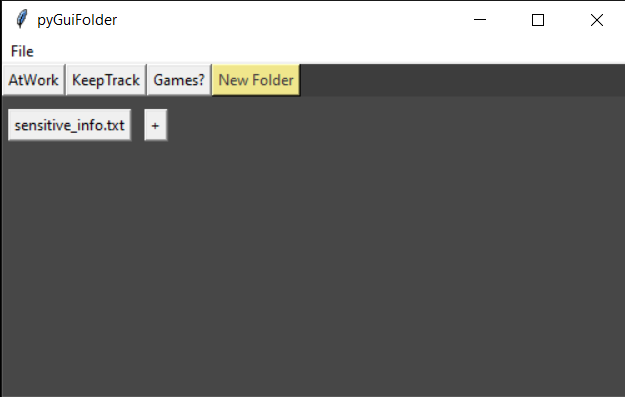

# PyGUIFolder

## What does it do
Create virtual folders and add files as symlinks to them 



## Installation
First clone the repo

```bash
$ git clone https://github.com/n0sys/PyGUIFolder.git
```

Then run the app

```bash
$ python3 app.py
```

## Why

IDK tbh.. Might help to keep track of some files you use often